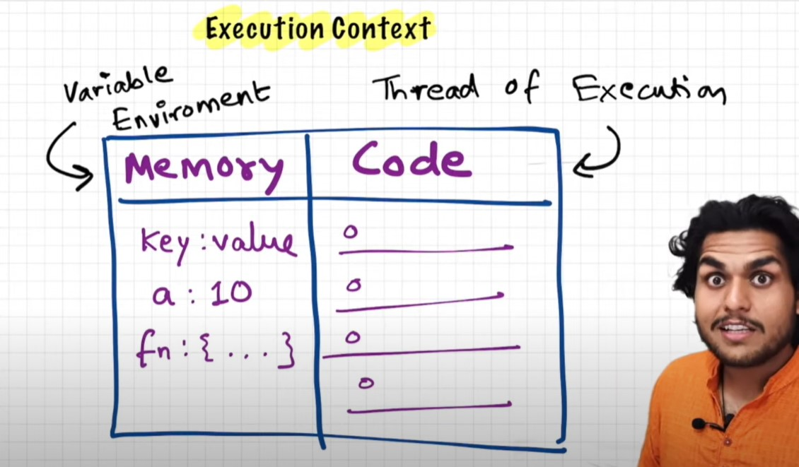
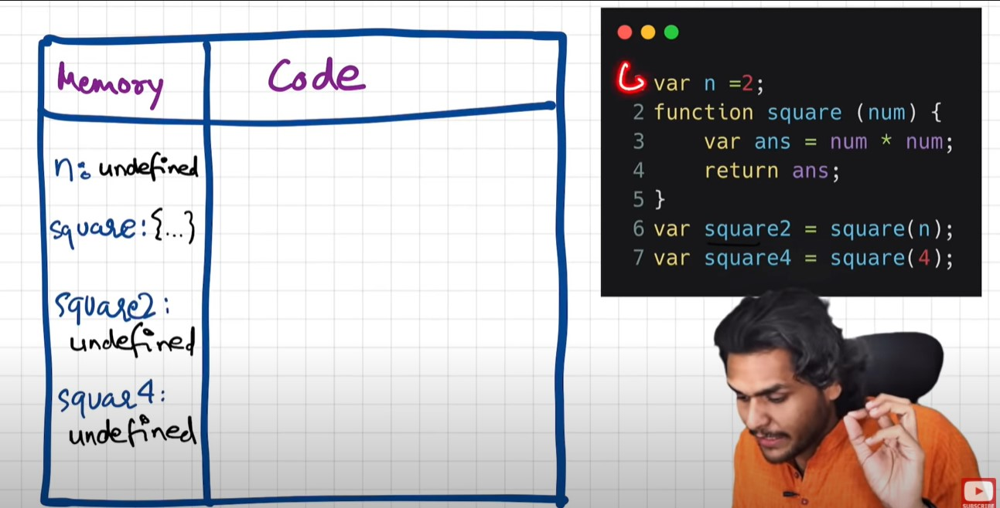
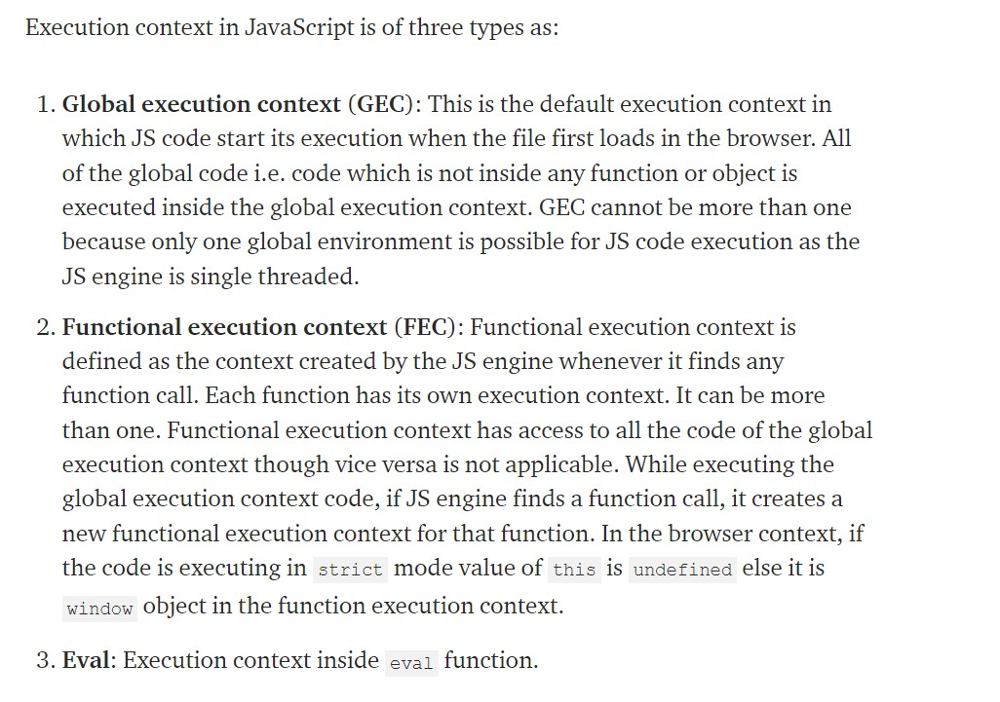
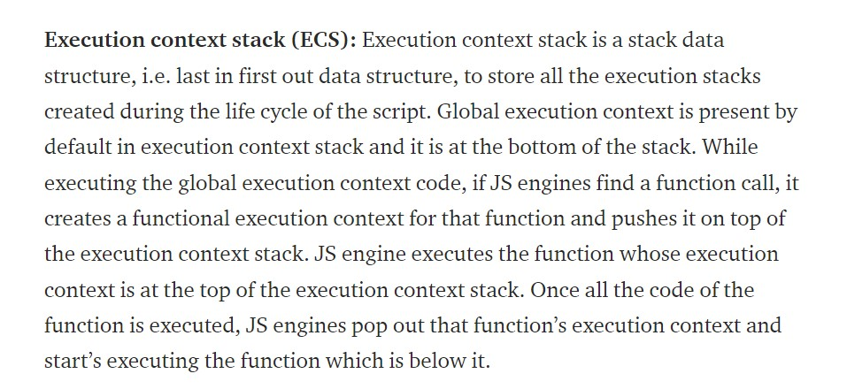
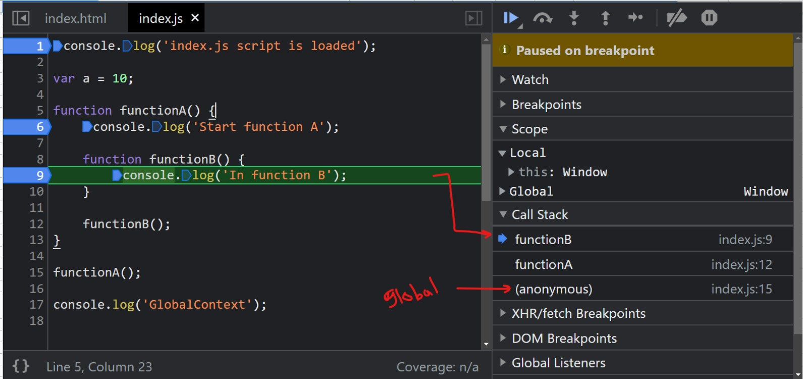
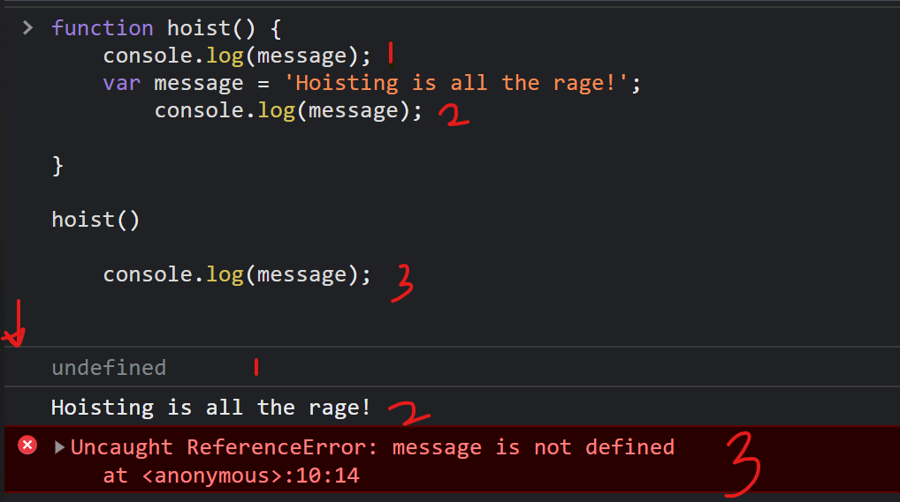

# JavaScript

Latest stable version is: ECMAScript 2021 / June 2021;

The following image summarizes the few versions of js.


**What is Ecmascript**

- European Computer Manufacturer's Association
  ECMA stands for - European Computer Manufacturer's Association. ECMAScript is a standard for a scripting language. It specifies the core features that a scripting language should provide and how those features should be implemented.

JavaScript is basically ECMAScript at its core but builds upon it. Languages such as ActionScript, JavaScript, JScript all use ECMAScript as its core.

**ECMAScript is a standard and that JavaScript is a well-known implementation of that standard**

# Execution Context

## Javascript is synchronous single threaded language

1. synchronous
   1. Means execution line by line and one line at a time
2. Single Threaded
   1. the execution of an entire task from beginning to end without interruption.

Sync v/s Async


## Everything in javascript happens inside an Execution Context.

Execution context (EC) is defined as the environment in which the JavaScript code is executed.

So its made of two parts

1. Memory - Store variables/functions etc.
2. Thread of execution - the code currently being executed





## Types of execution context



## Call Stack



As soon as the code loads, JS engine pushes the global execution context in the execution context stack.

When all the code is executed JS engine pops out the global execution context and execution of JavaScript ends.

Example:

```javascript
var a = 10;

function functionA() {
	console.log('Start function A');

	function functionB() {
		console.log('In function B');
	}

	functionB();
}

functionA();

console.log('GlobalContext');
```




## Stages of building execution context

JavaScript engine creates the execution context in the following two stages:

1.  Creation phase
    In the creation phase, JS engine is in the compilation phase and it just scans the code. And performs following tasks:

         a. Creates the Activation object or the Variable object

         b. Creates the scope chain

         c. Determines the value of "this"

2.  Execution phase
    This phase will scan the code again. Here, it will update the variable value and will execute the code.

### Creation phase

Example:

```javascript
function funA(a, b) {
	var c = 3;

	var d = 2;

	d = function () {
		return a - b;
	};
}

funA(3, 2);
```

Just after funA is called and before code execution of funA starts, JS engine creates an executonContextObj for funA which can be represented as shown below:

```javascript
executionContextObj = {
 variableObject: {}, // All the variable, arguments and inner function details of the funA
 scopechain: [], // List of all the scopes inside which the current function is
 this // Value of this
}
```

Activation object or the variable object in our case will be as shown below:

```javascript
variableObject = {
  argumentObject : {
    0: a,
    1: b,
    length: 2
  },
  a: 3,
  b: 2
  c: undefined,
  d: undefined then pointer to the function defintion of d
}
```


### Scope chain:

Whenever our code tries to access a variable during the function call, it starts the searching from local variables. And if the variable is not found, it’ll continue searching in its outer scope or parent functions’ scope until it reaches the global scope and completes searching for the variable there. Searching for any variable happens along the scope chain or in different scopes until we get the variable. If the variable is not found in the global scope as well, a reference error is thrown.

```javascript
cFunc = function (e) {
	var c = 10;
	var d = 15;

	console.log(c);
	console.log(a);

	function dFunc() {
		var f = 5;
		console.log(f);
		console.log(c);
		console.log(a);
	}

	dFunc();
};

cFunc(10);
```

Here, when function cFunc is called from the global execution context, the scope chain of cFunc will look like this

```
Scope chain of cFunc = [ cFunc variable object,
                         Global Execution Context variable object]
```

When dFunc is called from cFunc, as dFunc is inside cFunc, dFunc’s scope chain consists of dFunc variable object, cFunc variable object and global execution context variable object.

```
Scope chain of dFunc = [dFunc variable object,
                        cFunc variable object,
                        Global execution context variable object]
```

### Execution phase

In the execution phase, JS engines will again scan through the function to update the variable object with the values of the variables and will execute the code.

## Hoisting

JavaScript Hoisting refers to the process whereby the interpreter **APPEARS** to move the declaration of functions, variables or classes to the top of their scope, prior to execution of the code

**Of note however, is the fact that the hoisting mechanism only moves the declaration. The assignments are left in place.
**

```javascript
functionA(); // prints => "Start function A" and then executes functionB
console.log(a); //prints undefined

var a = 10;

console.log(a); //prints 10

function functionA() {
	console.log('Start function A');

	function functionB() {
		console.log('In function B');
	}

	functionB(); // prints => "In function B"
}

functionA(); // prints => "Start function A" and then executes functionB
```

However, in contrast, _undeclared variables do not exist until code assigning them is executed_. Therefore, **assigning a value to an undeclared variable implicitly creates it as a global variable when the assignment is executed**.

_This means that, all undeclared variables are global variables_.

```javascript
function hoist() {
	a = 20;
	var b = 100;
}

hoist();

console.log(a);
/* 
Accessible as a global variable outside hoist() function
Output: 20
*/

console.log(b);
/*
Since it was declared, it is confined to the hoist() function scope.
We can't print it out outside the confines of the hoist() function.
Output: ReferenceError: b is not defined
*/
```

**it is recommended to always declare variables regardless of whether they are in a function or global scope**

### ES5 & Hoisting

**var**

The scope of a variable declared with the keyword var is its _current execution context_. This is either the enclosing function or for variables declared outside any function, _global_.

**global variables**

```javascript
console.log(hoist); // Output: undefined

var hoist = 'The variable has been hoisted.';
```

**Function scoped variables**

As we’ve seen above, variables within a global scope are hoisted to the top of the scope. Next, let’s look at how function scoped variables are hoisted.

```javascript
function hoist() {
	console.log(message);
	var message = 'Hoisting is all the rage!';
}
hoist();
```



#### Strict Mode

Thanks to a utility of the es5 version of JavaScript known as strict-mode, we can be more careful about how we declare our variables. By enabling strict mode, we opt into a restricted variant of JavaScript that will not tolerate the usage of variables before they are declared.

We enable strict mode by prefacing our file or function with

    'use strict';

    // OR
    "use strict";

Let’s test it out.

```javascript
'use strict';

console.log(hoist); // Output: ReferenceError: hoist is not defined
hoist = 'Hoisted';
```

#### ES6

**let**

Before we start, to be noted is the fact that variables declared with the keyword let are block scoped and not function scoped.

```javascript
console.log(hoist); // Output: ReferenceError: hoist is not defined ...
let hoist = 'The variable has been hoisted.';
```

**const**

The const keyword was introduced in es6 to allow immutable variables. That is, variables whose value cannot be modified once assigned.

```javascript
const PI = 3.142;

// Let's reassign the value of PI
PI = 22 / 7; // TypeError: Assignment to constant variable.
```

constant variable must be both declared and initialised before use

```javascript
const PI;
console.log(PI); // Ouput: SyntaxError: Missing initializer in const declaration
PI=3.142;
```

With const, just as with let, the variable is hoisted to the top of the block.

```javascript
console.log(hoist); // Output: ReferenceError: hoist is not defined
const hoist = 'The variable has been hoisted.';
```

### Various ways to declare function

1. Function declarations

```javascript
function sum(a, b) {
	return a + b;
}

sum(5, 6); // => 11
```

2. Function expression

You can assign a function to javascript variables. Variable can be declared with const/let/var. Good practice is to define with const.

```javascript
const sum = function (a, b) {
	return a + b;
};

sum(5, 6); // => 11
```

OR

```javascript
const sum = function sum(a, b) {
	return a + b;
};

sum(5, 6); // => 11
```

3. Arrow function

```javascript
const sum = (a, b) => {
	return a + b;
};

sum(5, 6); // => 11
```

4. Other ways

```javascript
(function sum(a, b) {
	console.log(a + b);
})(5, 6); // => 11
```

### Hoisting functions

JavaScript functions can be loosely classified as the following:

1. Function declarations - are hoisted completely to the top
2. Function expressions - are not hoisted

**Function declarations**

```javascript
FunctionDeclarations(); // Output: "This function has been hoisted."

function FunctionDeclarations() {
	console.log('This function has been hoisted.');
}
```

**Function expressions**

```javascript
expression(); //Output: "TypeError: expression is not a function

var expression = function () {
	console.log('Will this work?');
};
```

```javascript
expression(); // Ouput: TypeError: expression is not a function

var expression = function hoisting() {
	console.log('Will this work?');
};
```

### Order of precedence for hoisting

It’s important to keep a few things in mind when declaring JavaScript functions and variables.

1. Variable assignment takes precedence over function declaration
2. Function declarations take precedence over variable declarations

**Variable assignment over function declaration**

```javascript
var double = 22;

function double(num) {
	return num * 2;
}

console.log(typeof double); // Output: number
```

**Function declarations over variable declarations**

```javascript
var double;

function double(num) {
	return num * 2;
}

console.log(typeof double); // Output: function
```

**Even if we reversed the position of the declarations, the JavaScript interpreter would still consider double a function.**
