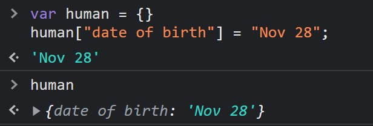

# Objects in JavaScript

An object in JavaScript is a collection of key-value pairs. Each key-value pair is called as a property. A property can be a function, an array, an object itself or any primitive data type i.e. integer, string, etc. Functions in object are called as methods.

Here firstName, lastName, and fullName are properties of the same object i.e. human. firstName is the key and Virat is the value of the property.

```JavaScript
var human = {
	firstName: "Virat",
	lastName: "Kohli",
	age: 30,
	fullName: function(){
		return this.firstName + " " + this.lastName
	},
    otherInformation: {
        adress:{
            city: 'Mumbai',
            street: 'street 1'
        },
        phone: '+91-312452345'
    }
}

console.log(human.fullName()); //Virat Kohli
```

## Different ways of creating a JavaScript object:

1. Using object literal

   ```javascript
   var human = {
   	firstName: 'Virat',
   	lastName: 'Kohli',
   	age: 30,
   	fullName: function () {
   		return this.firstName + ' ' + this.lastName;
   	},
   };
   ```

2. Using new Object()

   ```javascript
   var human = new Object();
   console.log(human); // Creates an empty object
   ```

   We can add as many properties as we want usign either the dot notation or the square bracket notation

   ```javascript
   human.firstName = 'Virat';
   human.lastName = 'Kohli';
   human.age = 30;
   human.fullName = function () {
   	return this.firstName + ' ' + this.lastName;
   };
   console.log(human);
   ```

3. Object constructor

   ```javascript
   function Human(firstName, lastName) {
   	(this.firstName = firstName),
   		(this.lastName = lastName),
   		(this.fullName = function () {
   			return this.firstName + ' ' + this.lastName;
   		});
   }
   ```

   Now you can create as many objects as you want using this constructor function:

   ```javascript
   var viratKohli = new Human('Virat', 'Kohli');
   console.log(viratKohli);
   var sachinTendulkar = new Human('Sachin', 'Tendulkar');
   console.log(sachinTendulkar);
   ```

**Properties of the object can be accessed using**

1. Dot notation.

   e.g. human.fullName(), human.firstName, human.otherInformation.adress

2. Square bracket

   e.g.

   ```
   human["firstName"]; //Output: Virat
   human["fullName"](); //Output: Virat Kohli
   ```

   ```
   var firstNameProperty = "firstName";
   console.log(human[firstNameProperty]) // Output: Virat
   ```

   **Note**: Above method of using variable to access property names cannot be used to access properties of the object using dot notation.

   ```
   Console.log(human.firstNameProperty) //Output: undefined
   ```

New properties can be added using the dot notation as shown below:

```JavaScript
human.age = 27
human.getAge = function(){
	return this.age;
}
```

An object property name can be any valid JavaScript string, or anything that can be converted to a string, including the empty string.

**However**, any property name that is not a valid Javascript identifier (for example, a property name that has a space or a hyphen, or that starts with a number) can only be accessed and added to the object property using the square bracket notation

```JavaScript
human["date of birth"] = "Nov 28";
human[12] = 12;
human.12 = 12; //gives error

console.log(human.12); //Gives error
console.log(human[12]); //Output: 12
```



## Delete a property from an object

To delete a property from an object we can use the delete operator. You cannot delete properties that were inherited, nor can you delete properties with their attributes set to configurable.

‘delete’ operator returns true if the delete was successful. It also return true if the property to delete was non-existent or the property could not be deleted.

```
delete human.firstName; // return true
```

Let’s see what happens if we try to call fullName method which uses both the firstName and lastName property of human object.

`console.log(human.fullName());// undefined Kohli`

Output is undefined because we were trying to access firstName property of human object which does not exists.
