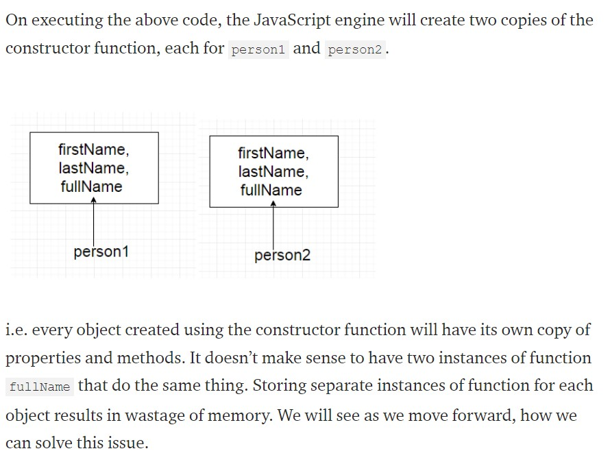
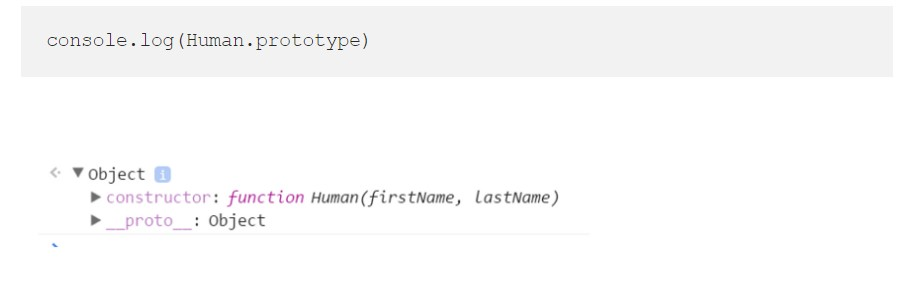
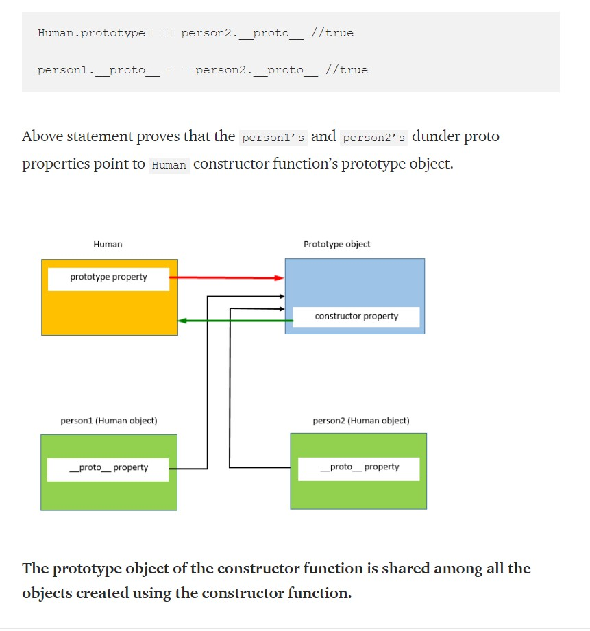
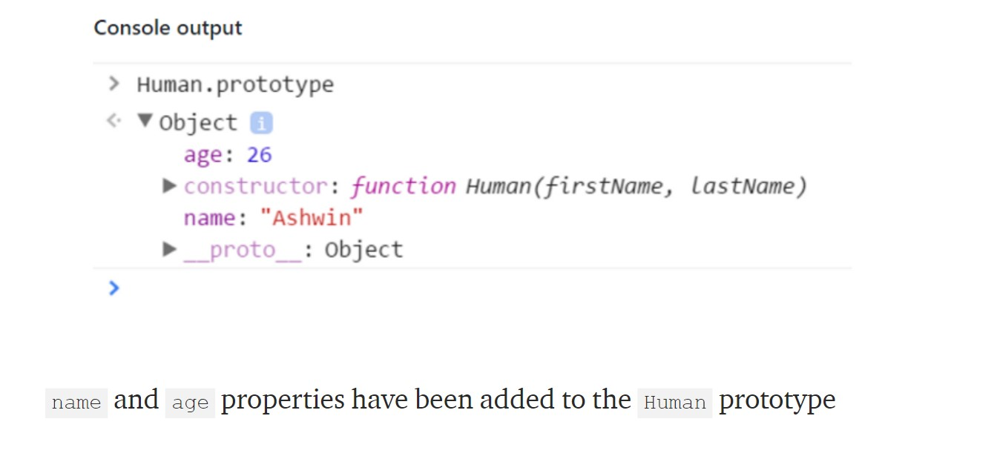
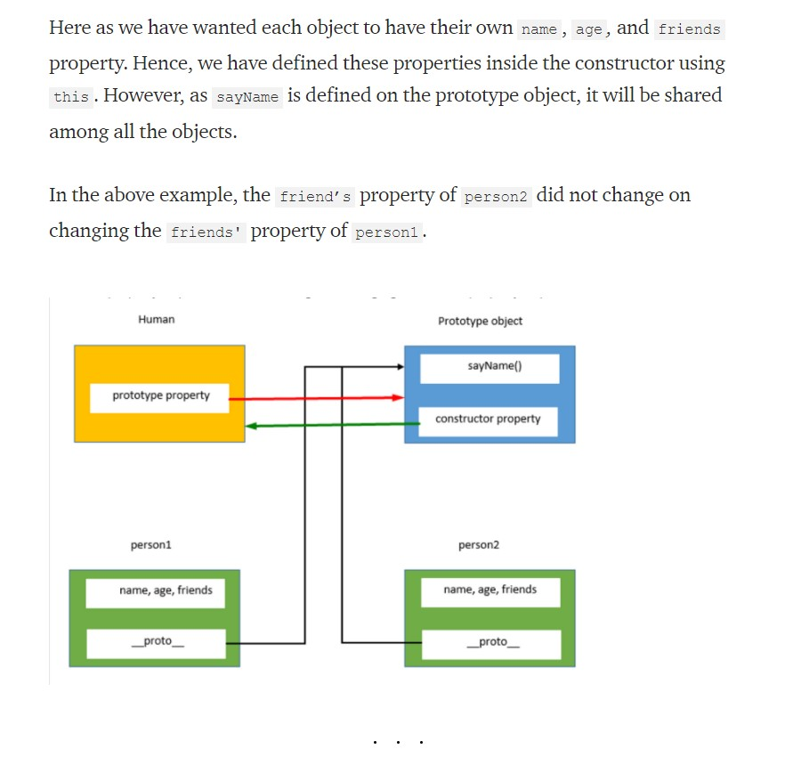

# Problem with creating objects with the constructor function:

Consider the constructor function below:

```javascript
function Human(firstName, lastName) {
	(this.firstName = firstName),
		(this.lastName = lastName),
		(this.fullName = function () {
			return this.firstName + ' ' + this.lastName;
		});
}

var person1 = new Human('Virat', 'Kohli');
var person2 = new Human('Sachin', 'Tendulkar');
```



When a function is created in JavaScript, the JavaScript engine adds a `prototype` property to the function. This prototype property is an object (called a prototype object) that has a constructor property by default.

The constructor property points back to the function on which `prototype` object is a property. We can access the function’s prototype property using `functionName.prototype`.





## Prototype Object or Prototype

Almost all objects in JavaScript have the prototype property. By using it and more specifically the _prototype chain_ we can mimic inheritance.

The prototype is a reference to another object and it is used whenever JS can’t find the property you’re looking for on the current object.

Simply put, whenever you call a property on an object and it doesn’t exist, JavaScript will go to the prototype object and look for it there. This can bubble up all the way to Object.prototype before returning undefined. This is the essence of the prototype chain and the behavior that sits behind JavaScript’s inheritance.

As a prototype object is an object, we can attach properties and methods to the prototype object. Thus, enabling all the objects created using the constructor function to share those properties and methods.

```javascript
//Dot notation
Human.prototype.name = 'Ashwin';
console.log(Human.prototype.name); //Output: Ashwin

//Square bracket notation
Human.prototype['age'] = 26;
console.log(Human.prototype['age']); //Output: 26

console.log(Human.prototype);
```



# Problem with creating objects with the Prototype:

```javascript
//Create an empty constructor function
function Person() {}
//Add property name, age to the prototype property of the Person constructor function
Person.prototype.name = 'Ashwin';
Person.prototype.age = 26;
Person.prototype.sayName = function () {
	console.log(this.name);
};

//Create an object using the Person constructor function
var person1 = new Person();
var person2 = new Person();

//Access the name property using the person object
console.log('person1.name ', person1.name); // Output" Ashwin
console.log(`person2.name `, person2.name); // Output" Ashwin

person1.name = 'john';

console.log('person1.name ', person1.name); // Output" Ashwin
console.log(`person2.name `, person2.name); // Output" Ashwin
```

In the following example, **if the intention is to have an array shared by all instances**, then this outcome is okay. But here this was not the case.

```javascript
//Create an empty constructor function
function Person() {}
//Add property name, age to the prototype property of the Person constructor function
Person.prototype.name = 'Ashwin';
Person.prototype.age = 26;
(Person.prototype.friends = ['Jadeja', 'Vijay']), //Arrays are of reference type in JavaScript
	(Person.prototype.sayName = function () {
		console.log(this.name);
	});

//Create objects using the Person constructor function
var person1 = new Person();
var person2 = new Person();

//Add a new element to the friends array
person1.friends.push('Amit');

console.log(person1.friends); // Output: "Jadeja, Vijay, Amit"
console.log(person2.friends); // Output: "Jadeja, Vijay, Amit"
```

## So What are the Problems?

1. Problem with the constructor function: Every object has its own instance of the function
2. Problem with the prototype: Modifying a property using one object reflects the other object also

To solve both problems, we can define all the object-specific properties inside the constructor and all shared properties and methods inside the prototype as shown below:

```javascript
//Define the object specific properties inside the constructor
function Human(name, age) {
	(this.name = name), (this.age = age), (this.friends = ['Jadeja', 'Vijay']);
}
//Define the shared properties and methods using the prototype
Human.prototype.sayName = function () {
	console.log(this.name);
};
//Create two objects using the Human constructor function
var person1 = new Human('Virat', 31);
var person2 = new Human('Sachin', 40);

//Lets check if person1 and person2 have points to the same instance of the sayName function
console.log(person1.sayName === person2.sayName); // true

//Let's modify friends property and check
person1.friends.push('Amit');

console.log(person1.friends); // Output: "Jadeja, Vijay, Amit"
console.log(person2.friends); //Output: "Jadeja, Vijay"
```


