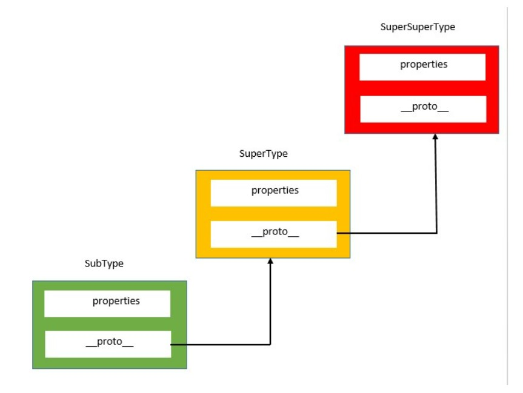
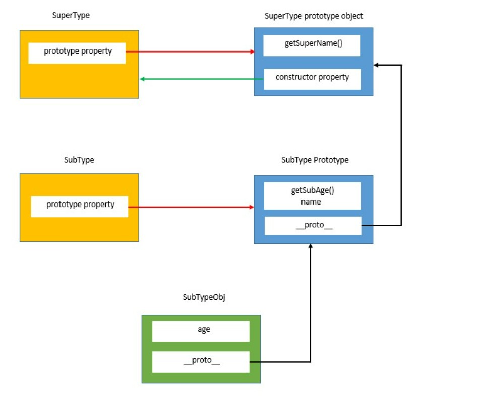

# Prototype Chaining, the way to achieve Inheritance in Javascript

JavaScript does not have classes unlinke other languages. It uses the concept of prototypes for inheritance

Prototype chaining means an objects dunder proto or proto will point to another object instead of pointing to the constructor function prototype.

If the other object's dunder proto or proto property points to another object it will results into chain. This is prototype chaining.



```javascript
//SuperType constructor function
function SuperType() {
	this.name = 'Virat';
}

//SuperType prototype
SuperType.prototype.getSuperName = function () {
	return this.name;
};

//SubType prototype function
function SubType() {
	this.age = 26;
}

//Inherit the properties from SuperType
SubType.prototype = new SuperType();

//Add new property to SubType prototype
SubType.prototype.getSubAge = function () {
	return this.age;
};

//Create a SubType object
var subTypeObj = new SubType();
console.log('subTypeObj.name', subTypeObj.name); //Output: Virat
console.log('subTypeObj.age', subTypeObj.age); //Output: 26
console.log('subTypeObj.getSuperName()', subTypeObj.getSuperName()); //Output: Virat
console.log('subTypeObj.getSubAge()', subTypeObj.getSubAge()); //Output: 26
```

**Note: New methods must be added to the SubType after the inheritance because inheritance overwrites the existing prototype of SubType**



# Problems with prototype chaining

As all the properties of the super type prototype are shared among the child objects, if one child modifies the property of the Super type prototype, other childs also gets affected. This issue has been explined in greate details here

To fix this issue, we use constructor to inherit the instance properties and prototype chaining to to inherit methods and share properties
