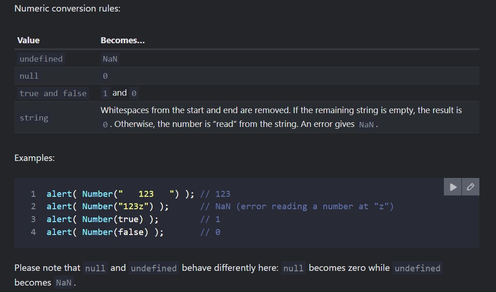
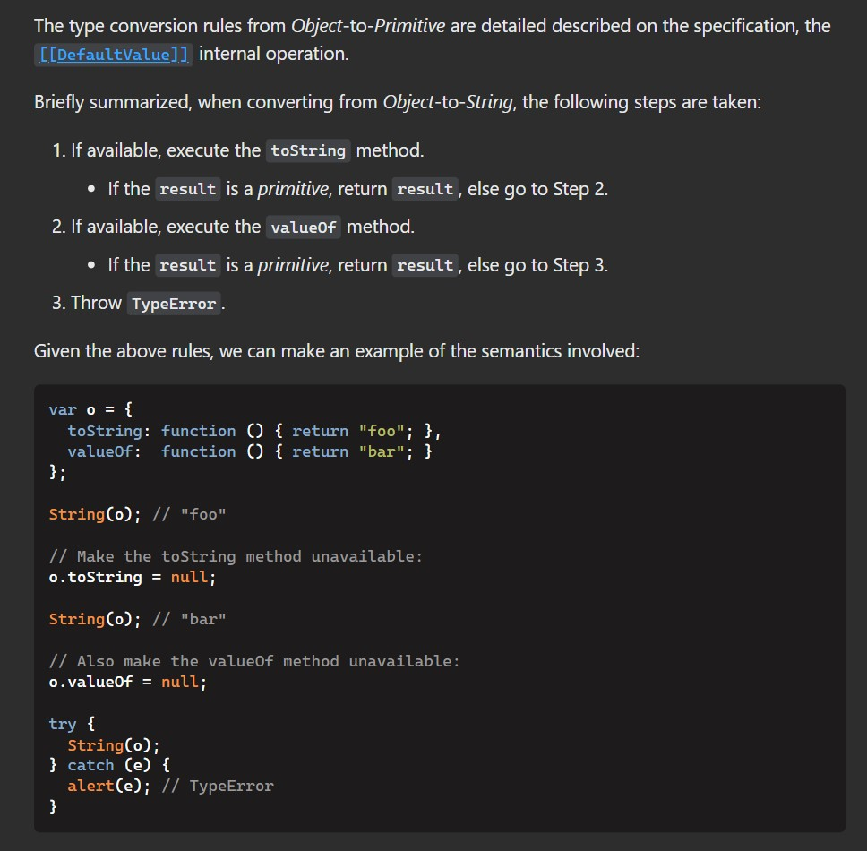

# Type Conversions

Most of the time, operators and functions automatically convert the values given to them to the right type.

For example,

- **alert automatically converts any value to a string to show it**.
- **Mathematical operations convert values to numbers.**

# String Conversion

call the String(value) function to convert a value to a string:

```javascript
let value = true;
alert(typeof value); // boolean

value = String(value); // now value is a string "true"
alert(typeof value); // string

String(false); // "false"
String(null); // "null"
```

# Numeric Conversion

- Numeric conversion happens in **mathematical functions** and **expressions** automatically.
- We can use the Number(value) function to explicitly convert a value to a number:

```javascript
Number(''); //0
Number(' '); //0
```



# Boolean conversion rules

Please note: the string with zero "0" is true

```javascript
alert(Boolean('0')); // true
alert(Boolean(' ')); // spaces, also true (any non-empty string is true)
```


# Precedence of operator

if you use same type of operators in an expression (i.e. expression contains numbers) then it will perform left to right operation

```javascript
alert(5 + 5 + 'px'); // 10px
alert('px' + 5 + 5); // px55
```

if you have higher Precedence operators in expression the evaluation will be different

```javascript
alert('px' + 5 * 5); // px25
```

For more on this [read here](https://developer.mozilla.org/en-US/docs/Web/JavaScript/Reference/Operators/Operator_Precedence)

# Some special functions

## parseFloat() vs parseInt vs Number vs +"(string value)"

parseFloat/parseInt is for parsing a string, while Number/+ is for coercing a value to a number. They behave differently. But first let's look at where they behave the same:

```javascript
parseFloat('3'); // => 3
Number('3'); // => 3
parseFloat('1.501'); // => 1.501
Number('1.501'); // => 1.501
parseFloat('1e10'); // => 10000000000
Number('1e10'); // => 10000000000
```

parseInt will trucate decimal part

```javascript
parseInt('12.2'); // 12
```

However, if your input starts with a number and then contains other characters, parseFloat truncates the number out of the string, while Number gives NaN (not a number):

```javascript
parseFloat('1x'); // => 1
parseInt('1x'); // => 1
parseFloat('3px'); // => 3
parseInt('3px'); // => 3
Number('1x'); // => NaN
```

Number understands hexadecimal input while parseFloat does not:

```javascript
parseFloat('0x10'); // => 0
parseInt('0x10'); // => 16
Number('0x10'); // => 16
```

Note that using the unary + operator is exactly the same as using Number as a function:

```javascript
Number('0x10'); // => 16
+'0x10'; // => 16
Number('10x'); // => NaN
+'10x'; // => NaN
Number('40'); // => 40
+'40'; // => 40
```

For empty string, they are different.

- **+"" and Number("") returns 0**
- **parseFloat("") and parseInt("") returns NaN**

```javascript
parseFloat(''); // => NaN
Number(''); // => 0
parseFloat(' \r\n\t'); // => NaN
Number(' \r\n\t'); // => 0
```

## toString() vs String()

value.toString() will cause an error if value is `null` or `undefined`. String(value) should not.

```javascript
var value = null;
alert(value.toString()); // TypeError exception

var value = null;
alert(String(value)); // "null"
```

# object to primitive



for more [read here](https://javascript.info/object-toprimitive#tostring-valueof)

// TODO Remaining notes here
