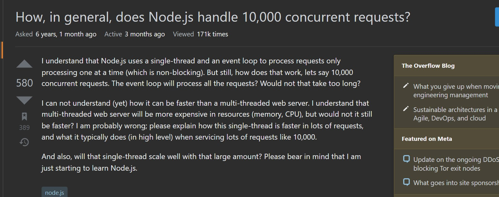
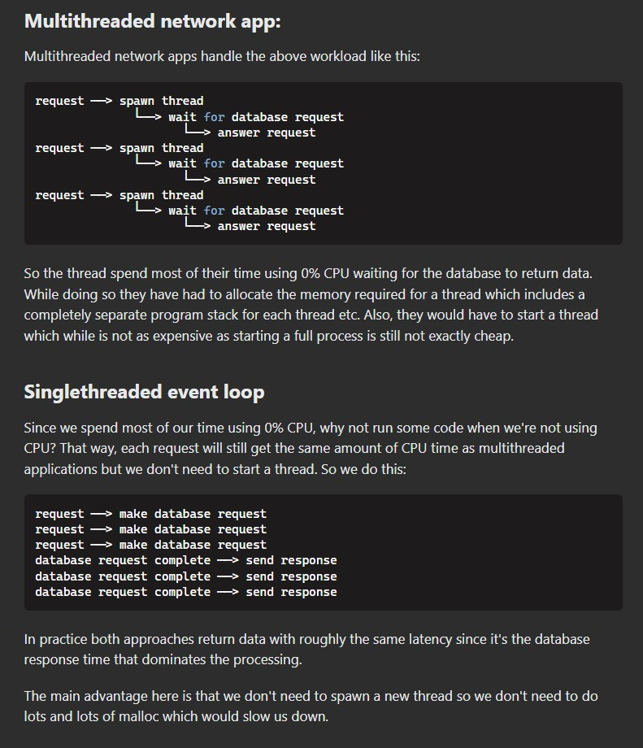

# Nodejs

Node.js is an open-source, cross-platform, JavaScript runtime environment.

Node.js runs the V8 JavaScript engine, the core of Google Chrome, outside of the browser. This allows Node.js to be very performant.

A Node.js app runs in a single process, without creating a new thread for every request. Node.js provides a set of asynchronous I/O primitives in its standard library that prevent JavaScript code from blocking and generally, libraries in Node.js are written using non-blocking paradigms

When Node.js performs an I/O operation, like reading from the network, accessing a database or the filesystem, instead of blocking the thread and wasting CPU cycles waiting, Node.js will resume the operations when the response comes back.

This allows Node.js to handle thousands of concurrent connections with a single server without introducing the burden of managing thread concurrency

# How NodeJs handles thousands of concurrent connections with a single server

[source](https://stackoverflow.com/questions/34855352/how-in-general-does-node-js-handle-10-000-concurrent-requests)

Think of NodeJS as a waiter taking the customer orders while the I/O chefs prepare them in the kitchen. Other systems have multiple chefs, who take a customers order, prepare the meal, clear the table and only then attend to the next customer.

In a conventional multi-threaded web server, you will typically have a thread for each request being handled, and it will process ONLY that request until it's finished. What happens if you have a lot of slow requests? You end up with a lot of your threads hanging around processing these requests, and other requests (which might be very simple requests that could be handled very quickly) get queued behind them.

### Magic, invisible threading

The seemingly mysterious thing is how both the approaches above manage to run workload in "parallel"? The answer is that the database is threaded. So our single-threaded app is actually leveraging the multi-threaded behaviour of another process: the database.

### Where singlethreaded approach fails

A singlethreaded app fails big if you need to do lots of CPU calculations before returning the data. Now, I don't mean a for loop processing the database result. That's still mostly O(n). What I mean is things like doing Fourier transform (mp3 encoding for example), ray tracing (3D rendering) etc.

Another pitfall of singlethreaded apps is that it will only utilise a single CPU core. So if you have a quad-core server (not uncommon nowdays) you're not using the other 3 cores.

### Where multithreaded approach fails

A multithreaded app fails big if you need to allocate lots of RAM per thread. First, the RAM usage itself means you can't handle as many requests as a singlethreaded app. Worse, malloc is slow. Allocating lots and lots of objects (which is common for modern web frameworks) means we can potentially end up being slower than singlethreaded apps. This is where node.js usually win.

One use-case that end up making multithreaded worse is when you need to run another scripting language in your thread. First you usually need to malloc the entire runtime for that language, then you need to malloc the variables used by your script.

So if you're writing network apps in C or go or java then the overhead of threading will usually not be too bad. If you're writing a C web server to serve PHP or Ruby then it's very easy to write a faster server in javascript or Ruby or Python.

### Hybrid approach

Some web servers use a hybrid approach. Nginx and Apache2 for example implement their network processing code as a thread pool of event loops. Each thread runs an event loop simultaneously processing requests single-threaded but requests are load-balanced among multiple threads.

Some single-threaded architectures also use a hybrid approach. Instead of launching multiple threads from a single process you can launch multiple applications - for example, 4 node.js servers on a quad-core machine. Then you use a load balancer to spread the workload amongst the processes.

In effect the two approaches are technically identical mirror-images of each other.

### Some more details on the architecture

Given a NodeJS application, since Node is single threaded, say if processing involves a Promise.all that takes 8 seconds, does this mean that the client request that comes after this request would need to wait for eight seconds? No.

**NodeJS event loop is single threaded. The entire server architecture for NodeJS is not single threaded.**

// TODO add more details on this
