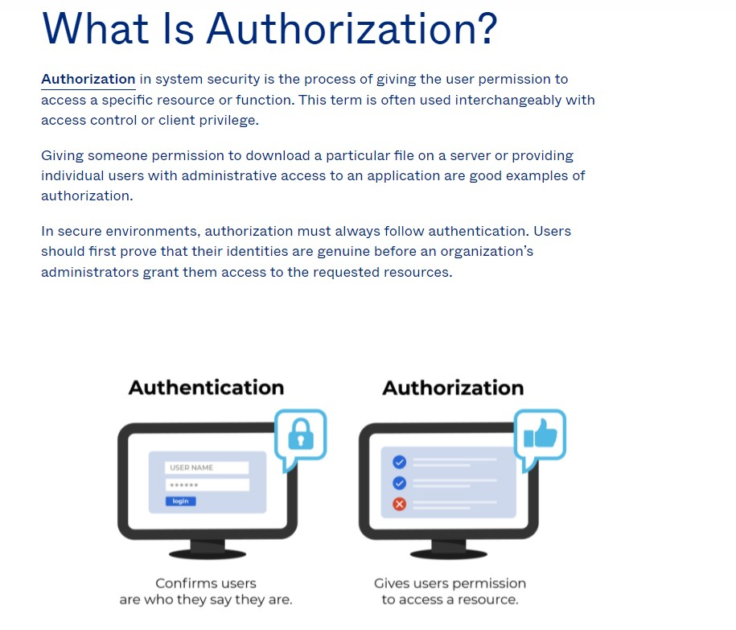

# Authentication

## Different ways for authentication

1. Basic
   1. username and password
   2. mobile number and OTP
   3. email and password
2. JWT
   1. It's a short for JSON Web Token
   2. JSON Web Token is a proposed Internet standard for creating data with optional signature and/or optional encryption whose payload holds JSON that asserts some number of claims.
   3. The tokens are signed either using a private secret or a public/private key.
   4. [What Is JWT and Why Should You Use JWT](https://www.youtube.com/watch?v=7Q17ubqLfaM)
   5. https://jwt.io/
3. OAuth 2
   1. [ref](https://www.digitalocean.com/community/tutorials/an-introduction-to-oauth-2)

# Authorization

## Common Authorization Methods

